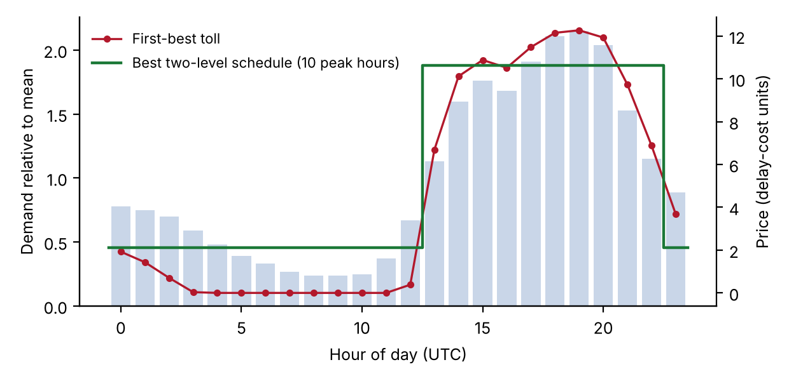
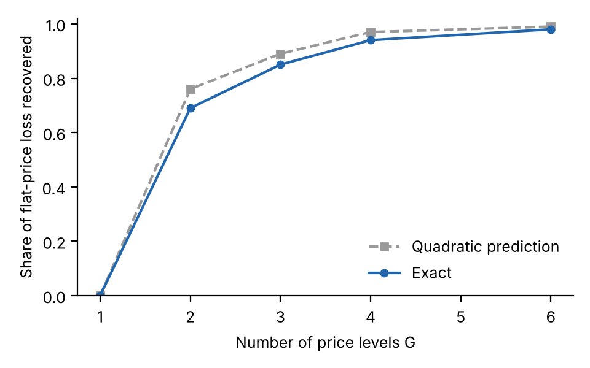
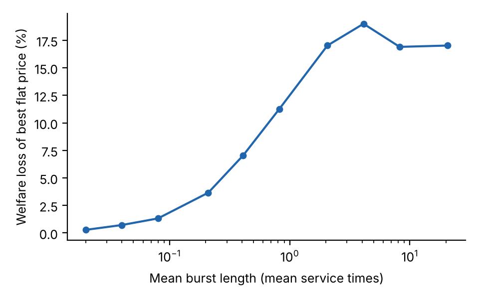

**Author:** Ook Lee — **Affiliation:** Department of Information Systems, Hanyang University, Seoul, Republic of Korea — **Corresponding author:** Ook Lee, ooklee@hanyang.ac.kr

## Highlights

- A flat price is first best only when all demand phases are alike
- Exact loss formula for flat pricing and a fast-switching limit are derived
- Two to four price levels recover most of the gain from hourly prices
- Poisson-based capacity planning understates servers needed on LLM traces

## Abstract

Providers of large language model (LLM) inference sell capacity that users share, so each request lengthens the wait of others. Most providers post a single per-token price and plan capacity as if requests arrived as a Poisson process. We ask when that decision rule is wrong and how much a simple alternative recovers. We model demand that moves between phases, such as hours of the day or bursts, with users who see the current phase and price but not the queue. Three results follow. The welfare-optimal price in a phase is the congestion toll and rises strictly with the phase's demand, so no flat price is first best unless the phases are alike. The best flat price is a weighted average of the phase tolls, and its welfare loss has an exact integral form. When phases switch quickly relative to the queue, a flat price becomes first best. We calibrate the model on public Azure and BurstGPT traces. On a trace with a strong daily cycle, a flat price loses 11 to 19 percent of the welfare of hour-by-hour prices across 18 parameter sets, and a two-level peak and off-peak schedule removes 65 to 73 percent of that loss. Poisson sizing understates the servers needed to meet a delay target by about a quarter on one conversation trace and by more than four fifths on a code trace. We discuss decision rules for pricing schedules and capacity planning.

**Keywords:** LLM inference; congestion pricing; Markov-modulated demand; peak-load pricing; capacity planning; queueing

## 1. Introduction

Inference for large language models (LLMs) is sold as a shared service. A request that arrives while the cluster is busy waits longer, and so do the requests behind it, yet the cost of that wait is borne by users and does not appear on the provider's invoice. Two decisions follow from this. The provider must set prices, and it must decide how many servers to provision. In practice the first decision is usually a time-invariant per-token price, and the second is made with models that treat arrivals as a Poisson process with a constant rate.

Neither rule is natural when demand moves in phases. The public workload traces analysed below [@patel2024; @stojkovic2025; @wang2024] show daily cycles and, on shorter time scales, bursts. A price that is right on average is then too high when the cluster is idle and too low when it is saturated. A few providers have begun to act on this. DeepSeek posts prices that are twice as high on weekday working hours as at other times, and at least one large provider sells a delay-tolerant tier at half the standard price and low-latency tiers at two to six times the standard price (Section 6.7). The question for a decision maker is whether such structures are worth having, how many price levels are needed, and how much capacity is wrongly planned if burstiness is ignored.

This paper studies these questions in a model that is simple enough to give exact statements and is calibrated on public traces. Demand is Markov-modulated: the system moves between phases, and in each phase users decide whether to send a request after seeing the current price and the expected delay. We make four contributions.

First, we characterize the welfare loss from a flat price. The first-best price in a phase equals the congestion toll, which increases strictly with the phase's demand. It follows that a flat price is first best only if all phases have the same demand, that the best flat price lies strictly between the smallest and largest phase tolls, and that the loss has an exact integral representation (Section 4.1). A local second-order formula is accurate for small dispersion and is not reliable far from it.

Second, we study switching speed. When phases switch fast relative to queue dynamics, every phase faces the same delay, and a flat price becomes first best in the limit (Section 4.2). In between, a numerical map for exact Markov chains shows that the loss is largest when bursts last a few mean service times.

Third, we study price schedules. In the quadratic regime the best schedule with $G$ price levels groups phases contiguously in their demand order, and the loss falls roughly like $1/G^2$ (Section 4.3). On a trace with a strong daily cycle, two levels recover about two thirds of the flat-price loss and four levels 87 to 96 percent.

Fourth, we calibrate on public traces. Poisson sizing is far off on both a conversation and a code trace from Azure, flat-price losses of 11 to 19 percent are stable across a grid of assumed parameters, and the peak to off-peak ratio of two posted by one provider is consistent with a serving cost of 8 to 25 percent of the marginal user's value (Section 6).

The contribution is deliberately narrow. We do not model competition, do not observe providers' costs, and obtain the strongest analytical statements only for slow or fast switching. Section 8 lists these limits.

The rest of the paper is organized as follows. Section 2 reviews related work. Section 3 sets up the model. Section 4 presents the analytical results, with proofs in Appendix A. Section 5 describes the data and Section 6 the numerical results. Section 7 discusses implications for decision makers, and Section 8 concludes.

## 2. Related literature

Our model builds on the economics of congestion in queues. Naor [@naor1969] showed that self-interested users join a queue more often than is socially optimal and that a toll restores efficiency. Mendelson [@mendelson1985] applied this logic to the pricing of computer services, and later work added user delay costs [@dewanmendelson1990], priority classes [@mendelsonwhang1990; @afeche2004] and the choice among control structures for pricing computer services [@dewan1996]. The monograph by Hassin and Haviv [@hassinhaviv2003] collects equilibrium results for queueing systems. These models assume a stationary arrival process. Our contribution is to let demand switch between phases.

Time variation in demand is the subject of peak-load pricing [@steiner1957; @boiteux1960], where capacity is fixed and demand is deterministic, so there is no queueing delay. In queueing systems, a literature on state-dependent and dynamic pricing asks how much is gained by conditioning price on the queue length. Paschalidis and Tsitsiklis [@paschalidis2000] and Ata and Shneorson [@ata2006] study congestion-dependent prices, and Kim and Randhawa [@kim2018] ask how much dynamic pricing adds to static pricing in large queueing systems; Bergquist and Elmachtoub [@bergquist2025] give performance guarantees for static pricing. Our prices depend instead on an exogenous demand phase that is observed by the provider, which is the setting in which time-of-day schedules are used. Our finding that a few price levels recover most of the gain is related in spirit to that line of work, but the mechanism is different (an exogenous phase, not the queue length) and we make no claim of equivalence.

Several recent papers study the economics and operations of LLM serving. Bergemann, Bonatti and Smolin [@bergemann2025] analyse menu pricing of LLMs. McDougall and Sankaralingam [@mcdougall2026] study latency-aware mechanism design for inference with private information on willingness to pay, task volume and time preference, and show that optimal per-task prices do not depend on volume. They abstract from queueing and state that stochastic demand would connect their framework to congestion externalities. That statement and ours address different objects: their result concerns linearity in volume, ours concerns constancy over time. On the operations side, recent work derives scheduling and control policies for prefill and decode contention [@lin2026; @dai2025]. We do not analyse scheduling and we treat the server as an M/M/$c$ queue. The public traces released with these studies [@patel2024; @stojkovic2025; @wang2024] motivate the demand model, and Markov-modulated Poisson processes are a standard tool for bursty traffic [@heffes1986; @fischer1993].

To the best of our knowledge, no earlier study combines Markov-modulated demand, welfare-optimal pricing with equilibrium demand, and a calibration to LLM traces. This statement rests on a limited literature search and should be read with that caveat.

## 3. Model

**Phases and demand.** The system moves between $K$ phases $k=1,\dots,K$ with long-run probabilities $\pi_k>0$. The provider and the users observe the current phase. In phase $k$ the inverse demand is $P_k(\lambda)=V(1-\lambda/\Lambda_k)$ for $0\le\lambda\le\Lambda_k$, where $\lambda$ is the request rate, $V>1$ is the willingness to pay of the highest-value user, and $\Lambda_k>0$ is the phase's demand potential. Values, prices and delay costs are expressed in units of the cost of waiting one mean service time. The phases differ only in $\Lambda_k$. Gross user value in phase $k$ is $B_k(\lambda)=\int_0^\lambda P_k(s)\,ds$.

**Delay.** The cluster has $c$ identical servers with unit service rate, and the mean sojourn time at request rate $\lambda$ is $d(\lambda)$, the M/M/$c$ value given by the Erlang C formula [@harchol2013]. We use three properties: $d$ is twice continuously differentiable, strictly increasing and convex on $[0,c)$, with $d(0)=1$ and $d(\lambda)\to\infty$ as $\lambda\uparrow c$. These properties are standard for the Erlang C sojourn time; we verified them numerically (up to floating-point precision) for $c\in\{1,2,7,45\}$. The total waiting cost rate is $D(\lambda)=\lambda d(\lambda)$, and we define the toll function $t(\lambda)=\lambda d'(\lambda)=D'(\lambda)-d(\lambda)$, which is the delay that one additional request imposes on all others. Because $d'>0$ and $d''\ge 0$, $t'(\lambda)=d'+\lambda d''>0$.

**Quasi-static queue and equilibrium.** In the baseline analysis the queue is in steady state at the current phase's rate, which is accurate when phases last long relative to the time the queue needs to relax. Section 4.2 and Section 6.4 relax this. A posted price $p_k$ applies in phase $k$. Users are small and join as long as the value of the marginal request covers the price and the expected delay, so the equilibrium rate $\lambda_k(p)$ solves $P_k(\lambda)=p+d(\lambda)$ whenever $p<V-1$ and equals zero otherwise.

**Welfare and serving cost.** Welfare in phase $k$ at price $p$ is $W_k(p)=B_k(\lambda_k(p))-D(\lambda_k(p))$, and expected welfare is $W(p)=\sum_k\pi_kW_k(p_k)$. A flat price uses $p_k=p$ for all $k$. If the provider also bears a marginal serving cost $c_0$ per request, welfare subtracts $c_0\lambda$; this is equivalent to replacing $V$ by $V-c_0$, with the price paid equal to $c_0$ plus the toll. We set $c_0=0$ in Sections 3 to 5 and reinstate it in Section 6.7.

## 4. Analytical results

### 4.1 First best, flat prices and the exact loss

Let $\lambda_k^*$ maximize $w_k(\lambda)=B_k(\lambda)-D(\lambda)$. Because $B_k$ is concave and $D''=2d'+\lambda d''>0$, $w_k$ is strictly concave, and $\lambda_k^*>0$ solves $P_k(\lambda)=D'(\lambda)$. It is implemented by the price $p_k^*=t(\lambda_k^*)$: the first-best price in a phase is the congestion toll at the first-best rate. Let $\kappa_k(p)=-\lambda_k'(p)=1/(V/\Lambda_k+d'(\lambda_k(p)))>0$ denote the sensitivity of the equilibrium rate to the price.

**Proposition 1 (tolls rise with demand).** If $\Lambda_j>\Lambda_k$ then $\lambda_j^*>\lambda_k^*$ and $p_j^*>p_k^*$.

**Proposition 2 (flat pricing).** (a) $W_k'(p)=-\kappa_k(p)\,[p-t(\lambda_k(p))]$, and $W_k$ is strictly increasing for $p<p_k^*$ and strictly decreasing for $p>p_k^*$. (b) If the $\Lambda_k$ are not all equal, no flat price attains first best, every maximizer $p^f$ of $W$ satisfies $\min_kp_k^*<p^f<\max_kp_k^*$, and it solves $\sum_k\pi_k\kappa_k(p^f)\,[p^f-t(\lambda_k(p^f))]=0$. If all $\Lambda_k$ are equal, the flat price $p^*$ is first best.

**Proposition 3 (exact loss).** For any flat price $p$,
$$W^{FB}-W(p)=\sum_k\pi_k\int_p^{p_k^*}\kappa_k(s)\,[t(\lambda_k(s))-s]\,ds\;\ge 0,$$
where each integral is nonnegative.

Proposition 2 says that the best flat price is a compromise: it overprices the quiet phases and underprices the busy ones. Proposition 3 gives the cost of the compromise exactly. For small dispersion in $\Lambda_k$, a second-order expansion gives a simple formula. With $\omega_k=\kappa_k(1+\kappa_kt'(\lambda_k^*))$ one has $W_k''(p_k^*)=-\omega_k$, and the loss of the best flat price is approximately $\tfrac12\sum_k\pi_k\omega_k(p_k^*-\bar p)^2$, where $\bar p$ is the $\pi\omega$-weighted mean of the $p_k^*$ (Proposition 4 in Appendix A). A numerical check in Section 6 shows that this formula is accurate for small spreads and overstates the loss for large ones. Direction matters here: pricing at the average demand does not systematically underprice. Whether the resulting price lies above or below the best flat price depends on the curvature of $\Lambda\mapsto p^*(\Lambda)$ (we find both cases in the data).

### 4.2 Switching speed

Let the phase process have generator $\theta G_0$ with $G_0$ irreducible and stationary distribution $\pi$, so that $\theta$ is the switching speed. To make the state space finite we assume a finite buffer $N$, as in all numerical Markov-chain computations below.

**Theorem 5 (fast switching).** Fix the request rates $(\lambda_k)$. As $\theta\to\infty$ the stationary distribution of (queue length, phase) converges to $\nu\otimes\pi$, where $\nu$ is the stationary law of the M/M/$c$ queue with the average rate $\bar\lambda=\sum_k\pi_k\lambda_k$. Consequently every phase faces the same delay $d(\bar\lambda)$, the first-best rates satisfy $P_k(\lambda_k)=D'(\bar\lambda)$ for all $k$, a flat price $p=t(\bar\lambda)$ implements them, and the welfare loss of the best flat price tends to zero.

The intuition is that a fast-switching queue cannot tell phases apart, so the externality a request imposes does not depend on its phase. Theorem 5 is an averaging result, proved by a standard perturbation argument for finite Markov chains [@schweitzer1968]; it does not give a rate. We do not have a proof of the rate at which the loss vanishes, and the numerical evidence in Section 6.4 suggests it is roughly linear in the dwell time, not quadratic. For slow switching the quasi-static results of Section 4.1 apply, which we state without proof of convergence.

### 4.3 How many price levels?

A schedule with $G$ levels partitions the phases into $G$ groups and posts one price per group. Order the phases by $x_k=p_k^*$, which by Proposition 1 is also the order of $\Lambda_k$.

**Proposition 6 (quadratic regime).** Approximate each $W_k$ by its second-order expansion at $p_k^*$ and put $w_k=\pi_k\omega_k$. (i) The loss of a partition with optimal prices equals half the weighted within-group sum of squares of the $x_k$, and the optimal group price is the weighted mean. (ii) An optimal partition is contiguous in the order of $x_k$. (iii) The share of the flat-price loss recovered by the best $G$-level schedule is the between-group share of the weighted variance of the $x_k$.

**Corollary 7 (bounds).** Let $q_k\propto w_k$, with mean $\mu$, mean absolute deviation $\mathrm{MAD}$ and standard deviation $\sigma$ under $q$. (a) The share recovered by two levels is at least $(\mathrm{MAD}/\sigma)^2$. (b) If the $x_k$ lie in $[a,b]$, the share recovered by $G$ levels is at least $1-(b-a)^2/(4G^2\sigma^2)$.

Corollary 7(a) gives $3/4$ for uniformly spread tolls and $2/\pi\approx0.64$ for Gaussian-like spreads. Both bounds are exact for the quadratic model only. A guarantee for the true welfare curves can be derived from curvature bounds (Appendix A), but in our calibration the local curvatures range from about 1 to about 200, so that guarantee is vacuous and we do not rely on it.

## 5. Data and calibration

**Traces.** We use four public data sets of LLM inference requests with arrival times and token counts. The Azure LLM inference traces for 2023 contain 19,366 conversation requests over 3,502 seconds and 8,819 code requests over 3,436 seconds [@azure2023]. The Azure 2024 code trace contains 16,803,695 requests over seven days [@azure2024]. The BurstGPT data contain 1,429,737 requests over 61 days in the file we used [@wang2024]. The traces record neither prices nor service times.

**Service times.** We construct a service time for each request as 0.5 ms per prompt token plus 30 ms per generated token. These coefficients are our assumption. The mean service time is 6.9 seconds on the 2023 conversation trace, 1.9 seconds on the 2023 code trace and 1.9 seconds on the 2024 code trace, so offered load is 38, 4.8 and 54 servers respectively. Because we express delays and prices in units of the mean service time, only the shape of the service-time distribution and the offered load enter the analysis.

**Arrival models.** For the two hour-long traces we compare the real arrival sequence with a Poisson process of the same rate, a two-state Markov-modulated Poisson process (MMPP) fitted to the index of dispersion for counts (IDC), a five-state Markov chain on the 30-second arrival rate, and a block bootstrap of the real arrivals. For the longer traces we estimate a rate profile by hour of day.

**Demand parameters.** The choke value $V$ and the ratio of unpriced demand to capacity are not observed. We use $V=20$ and a ratio of 1.4 as a baseline and vary both in Section 6.5.

## 6. Numerical results

### 6.1 Capacity planning under Poisson and bursty arrivals

The two 2023 traces differ sharply. Inter-arrival times on the conversation trace are close to Poisson (squared coefficient of variation 1.20), whereas the code trace is extremely bursty (173). Table 1 shows the number of servers needed to keep the probability that a request waits longer than one mean service time below 5 percent.

**Table 1.** Servers needed for $P(\text{wait}>\text{one mean service time})\le 5\%$.

| Arrival model | Conversation | Code |
|---|---|---|
| Real trace replay (one path) | 43 | 38 |
| Block bootstrap of real arrivals | 53 | 42 |
| Poisson, same rate | 41 | 7 |
| Five-state rate chain | 52 | 16 |
| Two-state MMPP fitted to IDC | 72 | 45 |

Relative to the bootstrap benchmark, Poisson planning understates the requirement by about 23 percent on the conversation trace and by more than 80 percent on the code trace. Two cautions apply. The single real path on the conversation trace needs fewer servers than the bootstrap, and one hour of data cannot tell whether that path is typical. The two-state MMPP matches the IDC but strongly overstates delay on the conversation trace, because the IDC of that trace grows almost linearly with the window, which indicates slow drift and not a two-level regime; matching second moments does not pin down the tail of the rate distribution that drives queueing. The five-state chain, which matches the rate distribution, comes closest on the conversation trace; it misses short bursts and so fails on the code trace.

On the seven-day Azure 2024 trace the rate peaks at 2.15 times its mean in the hours 14 to 21 UTC and falls to 0.24 times the mean around 08:00 to 10:00 UTC. At a mean utilization of 0.5 (108 servers) the mean wait under the real arrivals is about 2,000 seconds, compared with 86 seconds for an inhomogeneous Poisson process with the same daily profile and practically zero for a homogeneous Poisson process. The daily cycle explains much but not all of the delay.

### 6.2 Flat versus time-varying prices

We use the hour-of-day profile of the 2024 trace as 24 equally likely phases with $c=77$ servers, $V=20$ and unpriced demand of 1.4 times capacity. Relative to hour-by-hour first-best prices, a flat price loses 14.7 percent of welfare, the best two-level schedule loses 4.6 percent (14 off-peak hours at a toll of about 2.1 and 10 peak hours at about 10.6), and the absence of any price loses 44.1 percent. A two-level schedule therefore removes about 69 percent of the flat-price loss.

### 6.3 The number of price levels

Table 2 compares the prediction of Proposition 6 with the exact recovery computed from the full welfare curves by dynamic programming over contiguous groups.

**Table 2.** Share of the flat-price loss recovered by a $G$-level schedule (quadratic prediction / exact).

| $V$, unpriced demand, $c_0/V$ | Bound of Cor. 7(a) | $G=2$ | $G=3$ | $G=4$ | $G=6$ |
|---|---|---|---|---|---|
| 20, 1.4, 0 | 0.47 | 0.76 / 0.69 | 0.89 / 0.85 | 0.97 / 0.94 | 0.99 / 0.98 |
| 20, 1.4, 0.15 | 0.47 | 0.76 / 0.69 | 0.89 / 0.85 | 0.97 / 0.94 | 0.99 / 0.98 |
| 10, 1.2, 0 | 0.48 | 0.77 / 0.72 | 0.90 / 0.84 | 0.97 / 0.96 | 0.99 / 0.99 |
| 40, 2.0, 0 | 0.61 | 0.78 / 0.65 | 0.91 / 0.79 | 0.94 / 0.87 | 0.98 / 0.95 |

The bound of Corollary 7(a) holds in all four cases but is loose. The quadratic prediction overstates the exact recovery by 4 to 13 percentage points at $G=2$ and by less at larger $G$, and it reproduces the diminishing returns: two levels recover roughly two thirds of the loss, three levels about 80 to 85 percent, four levels 87 to 96 percent and six levels 95 to 99 percent.

### 6.4 Switching speed

We scale the dwell times of the code-trace MMPP by a factor $f$ and compute the loss of the best flat price relative to the best phase-dependent plan, using the exact Markov chain with equilibrium demand (Table 3).

**Table 3.** Loss of the best flat price versus switching speed (code-trace MMPP).

| Mean burst length (service times) | 0.02 | 0.08 | 0.4 | 2.1 | 4.1 | 8.2 | 21 |
|---|---|---|---|---|---|---|---|
| Flat-price loss (%) | 0.3 | 1.3 | 7.1 | 17.0 | 19.0 | 16.9 | 17.0 |

The loss is close to zero for very fast switching, as Theorem 5 predicts, rises roughly linearly with burst length (log–log slope about 1.1 for the four fastest settings), peaks for bursts of a few service times and levels off near 17 percent. Grid resolution limits accuracy to one or two percentage points. The slow-switching loss from the exact chain (about 17 percent) exceeds the quasi-static figure for the same trace (10.1 percent of first best, a different normalization), so quasi-static results should be treated as a conservative estimate when bursts are short compared with the time the queue needs to build up.

### 6.5 Robustness

Across 18 combinations of $V\in\{10,20,40\}$, unpriced demand $\in\{1.2,1.4,2.0\}$ times capacity and serving-cost share $c_0/V\in\{0,0.15\}$, the best flat price loses between 11.0 and 18.6 percent of first-best welfare, no price loses 37 to 57 percent, and the best two-level schedule removes between 65 and 73 percent of the flat-price loss. The levels of the losses depend on the assumed parameters, but their ordering does not.

### 6.6 Posted prices, equilibrium demand and non-exponential service

The preceding results hold for phase-dependent plans. Table 4 reports simulations in which users react to a posted price and to the simulated sojourn time of each phase (equilibrium demand), for service-time variability (squared coefficient of variation) from 0.5 to 16.

**Table 4.** Welfare loss relative to the best phase-dependent price schedule (%): no price / Poisson-calibrated flat price / best flat price.

| Service variability | Conversation (45 servers) | Code (7 servers) |
|---|---|---|
| 0.5 | 71 / 23 / 7 | 38 / 18 / 18 |
| 1 | 67 / 24 / 6 | 40 / 19 / 19 |
| 4 | 61 / 6 / 6 | 38 / 18 / 18 |
| 16 | 43 / 4 / 4 | 39 / 18 / 17 |

Pricing without regard to burstiness is not harmless. On the conversation trace, a flat price calibrated as if arrivals were Poisson loses 23 to 24 percent of welfare when service times are regular or exponential, against 6 to 7 percent for the best flat price, because a cluster of 45 servers looks uncongested on average. The code trace is insensitive to service variability, and on the conversation trace higher variability shrinks the losses, since delay is then already dominated by service variation. A separate exact calculation with heterogeneous user delay costs (half the users with half the standard delay cost, half with twice) leaves the flat-price loss at 10.2 percent (code) and 5.8 percent (conversation).

### 6.7 List prices and the serving cost

The pricing pages cited here were accessed on 9 October 2026. DeepSeek charges half the peak price off-peak, with peak hours of 01:00–04:00 and 06:00–10:00 UTC on weekdays excluding Chinese public holidays [@deepseek]; in China time these are working hours without the lunch break. OpenAI lists a delay-tolerant tier at half the standard price, a "Fast" tier at twice the standard price and, for some models, an "Ultrafast" tier at six times [@openai]. Amazon Bedrock offers reserved, priority, standard and flex tiers [@bedrock].

Two observations connect these structures to the model. First, a posted ratio of two is optimal in the model only if the serving cost is a substantial share of the marginal user's value. With the 2024 daily profile, a peak to off-peak ratio of two in the optimal two-level schedule implies $c_0/V$ between 0.08 and 0.25, depending mainly on how far unpriced demand exceeds capacity (0.25 at a ratio of 1.4; 0.10 and 0.08 at ratios of 1.2 and 2.0). A single ratio identifies a single parameter, so this is a consistency check and not a test. Second, a schedule that imposes the ratio of two can be harmful when it is steeper than optimal: at $c_0/V=0.4$ the best two-level schedule with a ratio of two loses 19.0 percent of welfare, more than the best flat price (14.0 percent), whereas at $c_0/V$ of 0 to 0.2 it loses 4.6 to 5.2 percent. A schedule with the length and ratio posted by DeepSeek (seven peak hours, ratio of two) is also worse than the best free schedule in the model, losing 6.3 to 7.1 percent at low serving cost. The demand profile here is that of an Azure code workload and not DeepSeek's.

Not all traces support a daily schedule. On the BurstGPT file the daily request count varies from about 1,600 to about 150,000, so multi-day swings dominate. Treating each clock hour of the trace as a phase, a flat price loses 14.5 percent of the welfare of real-time hourly prices, an hour-of-day schedule loses 14.2 percent, and no price loses 48.3 percent. The predictable component of demand is then small, and observed list prices contain no instrument that responds to such swings other than quantity limits and error codes.

## 7. Implications for decision makers

**Planning capacity.** The mean utilization is not a sufficient statistic. Both the daily profile and the burstiness after removing it should be measured on the provider's own logs, and the number of servers should be tested by replaying that log, not computed from an Erlang formula alone. In our traces the Poisson formula was too optimistic by 23 to over 80 percent.

**Designing price schedules.** If demand has a predictable daily cycle, a posted schedule with two to four price levels captures most of the available gain, and the first two levels already capture about two thirds. The schedule should follow the ordering of expected demand; contiguous groups of hours are optimal in the quadratic model. The ratio between the levels matters: a steeper-than-optimal ratio can leave a schedule worse than a flat price, and the optimal ratio falls when serving costs are a large share of value.

**When time-varying prices are not worth it.** Fast fluctuations (bursts shorter than a few service times) are averaged away by the queue, and a flat price loses little. When fluctuations are mostly unpredictable multi-day swings, as in the BurstGPT file, an hour-of-day schedule helps little, and quantity limits or real-time pricing are the relevant instruments.

## 8. Limitations and conclusions

The theory rests on a quasi-static queue for slow switching, a finite-buffer averaging argument for fast switching, and linear demand. The rate at which the flat-price loss vanishes under fast switching is not proved, and the quadratic results for schedules are local. The service times are constructed from token counts with assumed coefficients, and the choke value and the ratio of unpriced demand to capacity are assumed; their levels affect the size of the losses but not, in our robustness grid, their ordering. The traces cover one hour (2023), seven days (2024) and 61 days (BurstGPT), the last of which is dominated by multi-day swings that no model here describes. The serving cost is identified only through one posted price ratio. We do not model competition among providers, strategic behaviour beyond the equilibrium of small users, or quantity limits as an alternative to price. Preliminary calculations with two competing providers suggest that phase-dependent prices can raise profits without raising welfare; a proper treatment is left for future work.

We have asked when a flat per-token price is the wrong decision rule for shared LLM inference capacity. In the model, it is wrong whenever demand differs across phases, the loss has a simple exact form, and it vanishes when phases switch fast relative to the queue. In calibrations on public traces the loss is 11 to 19 percent of welfare for a trace with a strong daily cycle, and two to four posted price levels recover most of it. For providers, the practical message is to measure the daily profile and burstiness of their own demand, size capacity by replay, and consider a short posted schedule whose ratio is chosen with care.

## Appendix A. Proofs

**Lemma A1.** For $p<V-1$ the equilibrium rate $\lambda_k(p)$ is unique and continuously differentiable with derivative $-\kappa_k(p)$.

*Proof.* The map $\lambda\mapsto P_k(\lambda)-d(\lambda)$ is strictly decreasing and starts at $V-1>0$. Apply the implicit function theorem. $\square$

**Proof of Proposition 1.** The function $V(1-\lambda/\Lambda)$ is strictly increasing in $\Lambda$ for $\lambda>0$, so $P_j(\lambda_k^*)>P_k(\lambda_k^*)=D'(\lambda_k^*)$. Since $P_j-D'$ is strictly decreasing in $\lambda$ and positive at $\lambda_k^*$, its root $\lambda_j^*$ exceeds $\lambda_k^*$. Since $t'>0$, $p_j^*=t(\lambda_j^*)>t(\lambda_k^*)=p_k^*$. $\square$

**Proof of Proposition 2.** (a) Differentiating, $W_k'(p)=(B_k'-D')\lambda_k'=(P_k(\lambda_k)-d-\lambda_kd')(-\kappa_k)$. At equilibrium $P_k(\lambda_k)=p+d(\lambda_k)$, so $W_k'=-\kappa_k(p-t(\lambda_k))$. The function $w_k$ is strictly increasing below $\lambda_k^*$ and strictly decreasing above, and $\lambda_k(p)$ is strictly decreasing in $p$, so $W_k$ is strictly increasing for $p<p_k^*$ and strictly decreasing for $p>p_k^*$. (b) $W_k(p)\le W_k(p_k^*)$ with equality only at $p=p_k^*$. If the $\Lambda_k$ differ, the $p_k^*$ differ by Proposition 1, so no price attains the maximum in all phases. For $p\le\min_kp_k^*$ every $W_k$ is nondecreasing and at least one is strictly increasing, hence $W'(p)>0$; symmetrically $W'(p)<0$ for $p\ge\max_kp_k^*$. A maximizer therefore lies strictly inside $(\min p_k^*,\max p_k^*)$ and satisfies $W'(p^f)=0$, which is the stated condition. If all $\Lambda_k$ are equal, all $p_k^*$ coincide and the flat price $p^*$ is first best. $\square$

**Proof of Proposition 3.** $W_k(p_k^*)-W_k(p)=\int_p^{p_k^*}W_k'(s)\,ds=\int_p^{p_k^*}\kappa_k(s)[t(\lambda_k(s))-s]\,ds$ by part (a) of Proposition 2, and the integrand has the sign of $p_k^*-s$. Weight by $\pi_k$ and sum. $\square$

**Proposition 4 (local loss).** Let $\omega_k=\kappa_k(1+\kappa_kt'(\lambda_k^*))$. Then $W_k''(p_k^*)=-\omega_k$, and the loss of the best flat price equals $\tfrac12\sum_k\pi_k\omega_k(p_k^*-\bar p)^2+o(\max_k(p_k^*-\bar p)^2)$ with $\bar p=\sum_k\pi_k\omega_kp_k^*/\sum_k\pi_k\omega_k$.

*Proof.* From $W_k'=-\kappa_k(p-t(\lambda_k(p)))$, $W_k''=-\kappa_k'(p-t)-\kappa_k(1-t'\lambda_k')$. At $p=p_k^*$ the first term vanishes and $\lambda_k'=-\kappa_k$. Expand each $W_k$ to second order around $p_k^*$ and maximize the resulting quadratic over $p$. $\square$

**Proof of Theorem 5.** Let $\mu_\theta$ be the stationary law of $Q_\theta=\theta Q_0+Q_1$ on the finite state space, where $Q_0$ changes only the phase and $Q_1$ holds the queue transitions with phase-dependent arrival rates. $Q_\theta$ is irreducible for every $\theta>0$. Dividing $\mu_\theta Q_\theta=0$ by $\theta$ gives $\mu_\theta Q_0=-\theta^{-1}\mu_\theta Q_1$, so every limit point $\mu$ satisfies $\mu Q_0=0$ and therefore has the form $\mu(n,k)=m(n)\pi_k$. For a function $f$ of the queue length only, $Q_0f=0$, hence $\mu_\theta Q_1f=0$ for all $\theta$ and in the limit $\sum_nm(n)\sum_k\pi_k(Q_1f)(n,k)=0$. Thus $m$ is invariant for the birth–death generator with arrival rate $\sum_k\pi_k\lambda_k$, which is irreducible and has a unique invariant law $\nu$. Hence $\mu_\theta\to\nu\otimes\pi$. Welfare is a continuous function of $\mu_\theta$ and the rates, so $W_\theta\to W_\infty(\lambda)=\sum_k\pi_kB_k(\lambda_k)-D(\bar\lambda)$ uniformly on the compact set of feasible rates. Maximizing $W_\infty$ gives $P_k(\lambda_k)=D'(\bar\lambda)$ for all $k$ (differentiate in $\lambda_k$ and divide by $\pi_k$). The flat price $t(\bar\lambda)$ implements these rates, because in the limit every phase faces the delay $d(\bar\lambda)$. The first best and the best flat price therefore both converge to $\max W_\infty$, and the loss is bounded by the sum of two uniform-convergence errors, which vanish. $\square$

**Proof of Proposition 6.** (i) Within a group the loss is a weighted quadratic in the common price, minimized at the weighted mean. (ii) Fix the prices of an optimal schedule and assign each phase to the nearest price; this cannot raise the loss. Nearest-price regions are intervals of the line, so after reassignment, and after re-optimizing prices, the groups are contiguous. (iii) is the definition of the between-group share. $\square$

**Proof of Corollary 7.** (a) Split at the mean $\mu$ into a lower and an upper group with probabilities $P_L,P_U$ and means $m_L,m_U$. The between-group variance is $P_LP_U(m_U-m_L)^2$, and $E|X-\mu|=2P_LP_U(m_U-m_L)$. Hence between$/\mathrm{Var}=(E|X-\mu|)^2/(4P_LP_U\,\mathrm{Var})\ge(E|X-\mu|)^2/\mathrm{Var}$, because $4P_LP_U\le1$. The best two-group partition does at least as well as the mean split. (b) Cut $[a,b]$ into $G$ intervals of width $h=(b-a)/G$ and put each group price at its interval midpoint. Each point is then within $h/2$ of its price, so the within-group sum of squares is at most $h^2/4$. Dividing by the total variance $\sigma^2$ gives the bound; optimal weighted means do no worse. $\square$

**Curvature bound.** Suppose $\omega_{lo}\le-W_k''(p)\le\omega_{hi}$ on $[a,b]\ni p_k^*$ for all $k$. Then, using $W_k'(p_k^*)=0$, $\tfrac{\omega_{lo}}2(p-p_k^*)^2\le W_k(p_k^*)-W_k(p)\le\tfrac{\omega_{hi}}2(p-p_k^*)^2$, and the share recovered by a $G$-level schedule is at least $1-(\omega_{hi}/\omega_{lo})(1-R_G^{\pi})$, where $R_G^{\pi}$ is the between-group share of the $\pi$-weighted variance of the $p_k^*$.

## Appendix B. Replication

All code and result tables are in the public project repository [repository URL to be inserted]. Data are not redistributed; download links are given in the repository README. Random seeds are fixed in the scripts. Service times are constructed with the coefficients stated in Section 5.

## Declaration of generative AI and AI-assisted technologies in the manuscript preparation process

During the preparation of this work the author used a generative AI assistant (Claude, Anthropic) to write and run the simulation code, to carry out the numerical experiments, to search for and check bibliographic records, and to draft and edit the text. After using this tool, the author reviewed and edited the content as needed and takes full responsibility for the content of the published article. [Author: edit this statement so that it matches what was actually done.]

## Declarations

**CRediT authorship contribution statement.** [To be completed.] **Funding.** [To be completed.] **Declaration of competing interest.** [To be completed.] **Data availability.** The traces are public (see references); the code and result tables are available in the repository named in Appendix B.

## References

[Reference list is generated from the verified bibliography; see build script.]
