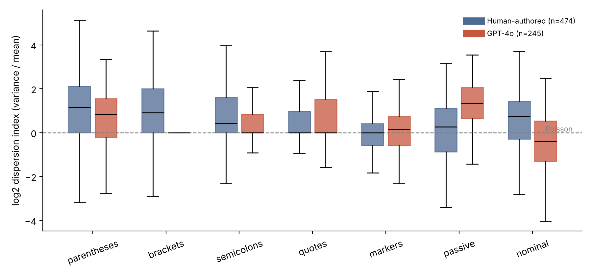

# Abstract

Organizations that publish or archive scholarly documents now face a screening problem: language models can produce papers faster and more cheaply than anyone can check them. Two common remedies, LLM-as-a-judge and embedding-based similarity metrics, are either expensive and prompt-dependent or insensitive to fine-grained statistical structure. We study a lightweight alternative that treats the occurrence of selected linguistic events (special punctuation, discourse markers, passive constructions, nominalizations) as count processes and asks how far a document departs from human-authored text. Using 474 human-written papers from PubMed Central and arXiv (2015–2019) and matched papers from three generators (GPT-4o, 245 papers; Claude Sonnet 5.5, 152; Llama 3.3 70B, 202), we report eight findings. First, human text is not Poisson: for punctuation events, 36–49% of documents reject the Poisson null because of over-dispersion. Second, a single Poisson-distance index performs near chance (AUC 0.51–0.54). Third, a vector of event rates and dispersion indices separates human from machine text well when the detector is trained and tested on the same generator (AUC 0.91–0.99), but not across generators: a detector trained on GPT-4o reaches 0.73 on Claude. Fourth, dispersion transfers better than event rates, which differ in sign across generators. Fifth, detectors trained on human papers alone perform near chance to modestly above it. Sixth, we propose a scale-dependent clustering model, a doubly stochastic (Cox) Poisson process summarized by how the Fano factor changes with window size. In a test specified before the Llama data were collected, it raised AUC on the unseen Llama papers from 0.89 to 0.93 (difference +0.046, 95% interval 0.030 to 0.063). Seventh, in a blind comparison on 500 excerpts with two zero-shot LLM judges, the answer depended on the judge and on the generator. GPT-4o as judge reached AUCs of 0.76, 0.45, and 0.85 against GPT-4o, Claude, and Llama papers, below the Poisson-based detectors trained on the other generators (0.95, 0.77, and 0.93). Gemini 2.5 Pro, a stronger judge that is not one of the generators, did better than those detectors on GPT-4o and Llama papers (0.97 and 0.97) but worse on Claude papers (0.66), which both judges almost never flagged. Eighth, a label-free fusion of the Poisson screen with the Gemini judge, specified in advance, was better than either alone on GPT-4o and Llama papers (AUC 0.99 on both) and no worse than the screen on Claude papers (0.79), where it detected 39% of papers at a 5% false-positive rate, against 17% for the screen and 1% for the judge. The Poisson features cost nothing per document, against about US$0.007 and 1.7 seconds for GPT-4o and US$0.017 and 23 seconds for Gemini, but unlike the judges they need labeled examples. The evidence is limited to three generators, one genre, and two judges, and we do not test adversarial editing, embedding-based metrics, or the effect on human reviewers.

**Keywords:** information quality, synthetic text detection, count data, dispersion, generalization, scholarly publishing

# 1. Introduction

Scholarly publishing has long treated fluent, well-structured prose as weak evidence of effort. Large language models weaken even that signal. A model can draft an abstract, a methods section, or a plausible set of results in a minute, and the output is often good enough to survive a quick read. For publishers, preprint servers, and research-integrity offices, the practical question is no longer whether such text exists but whether it can be screened at a cost that scales with submission volume, and in a way that a human reviewer can understand and contest.

Current options fit this need poorly. Asking a strong model to grade a document (LLM-as-a-judge; Zheng et al., 2023) is flexible, but each call costs money, the verdict depends on prompt wording and on the judge's own preferences, and the reasoning cannot be audited in any statistical sense. Embedding-based comparisons such as MAUVE (Pillutla et al., 2021) and BERTScore (Zhang et al., 2020) are cheaper, but they mainly measure whether two sets of texts *mean* similar things. They say little about whether the texts *behave* alike at the level of small, countable habits, such as how often a semicolon appears in a section.

This paper pursues a different idea. Writers do not plan the frequency of small linguistic events. A parenthesis here, a passive clause there: these accumulate as a by-product of content and habit, which is the setting in which count models are natural. Language models, in contrast, are trained to make each next token locally likely, and decoding choices can smooth or regularize how often particular forms recur. If so, machine-written text may differ from human text in the *distribution* of event counts, not only in their average, and a transparent statistical lens could pick this up at almost no cost.

The classical benchmark for counts of independent events is the Poisson distribution, whose variance equals its mean. An earlier version of this project assumed that human-authored scientific text approximately follows this benchmark and that LLM output departs from it. We test that assumption directly rather than adopting it. We also test something that detection studies often leave implicit: whether a detector built on one generator still works on another. We ask three questions, in the order a screening organization would:

- **RQ1 (Distributional fit).** Do human-authored papers follow a Poisson process in the selected events, and how does LLM-generated text differ?
- **RQ2 (Detection and transfer).** How well do Poisson-based quantities separate human from LLM-generated papers, which part of the signal (rates or dispersion) carries the discrimination, and does a detector built on one generator work on another?
- **RQ3 (Cost).** What does screening with these quantities cost in time and money?

A further question concerns whether explainable statistical evidence improves the decisions of human reviewers. It requires a controlled experiment with participants, which we have not run; we describe the intended design in Section 7 and report no results for it.

# 2. Background

**Information quality and governance.** The information quality literature treats accuracy and credibility as properties an organization has to monitor, not assume. Generative models change the economics of that monitoring because producing plausible content is now cheaper than verifying it. Screening cost per document is therefore a legitimate outcome alongside detection accuracy, a view consistent with the design-science tradition in information systems, in which an artifact is judged by whether it solves an organizational problem at acceptable cost (Hevner et al., 2004).

**Detection of machine-generated text.** Existing detectors include supervised classifiers, methods based on a language model's own probabilities (for example, Gehrmann et al., 2019; Mitchell et al., 2023), and judge-style evaluation. Most are opaque to the end user, and many degrade when the generating model changes. We trade breadth for transparency: every quantity we use can be traced to a specific, countable feature.

**Count data and dispersion.** For counts of independent events in fixed windows, the Poisson model implies a dispersion index (variance divided by mean) of one. Real text typically violates this, because topics, sections, and formatting conventions make events cluster. Count-data methods handle this by allowing extra variation, as in the negative binomial family (Cameron & Trivedi, 2013). The dispersion index is therefore best read as a descriptive summary of how clustered a document's events are, and we use it that way.

# 3. Data and Measures

## 3.1 Human-authored papers

We sampled English-language papers published between 2015 and 2019, before widespread use of LLMs for scientific writing. Papers came from the PubMed Central open-access subset (medicine; 300 sampled) and arXiv (computer science; 200 sampled), drawn at random within each source. For PubMed Central we used body paragraphs from the article XML. For arXiv we converted PDFs to text, removed the reference list, and joined broken lines. Documents shorter than 1,500 words were excluded, and the analysis requires at least four 500-token windows, which left 474 human papers.

## 3.2 Synthetic papers

For each sampled paper we asked a generator to write a paper on the same topic, given the original title and abstract, using one of three prompts of increasing detail. We used three generators through a commercial API gateway: GPT-4o, Claude Sonnet 5.5, and Llama 3.3 70B Instruct (an open-weight model, hosted). A single request yielded only about 800 words from GPT-4o, too short for window-based analysis, so each paper was generated in four requests (introduction, methods, results, discussion and conclusion) and concatenated. Prompts were presented in a fixed random order, so each subset is random across fields.

GPT-4o produced 245 unique papers (one source had been generated twice during testing and we kept one record), with a median of about 2,750 words. Claude produced 152 papers, with a median of 4,566 words (range 3,667 to 5,134); generation was capped at that number to limit cost, not because of any property of the output. Llama 3.3 70B Instruct, an open-weight model that we accessed through the same gateway, produced 202 unique papers (one source had again been generated twice and one record was kept), with a median of about 2,970 words (range 2,355 to 7,926). It was added last, after the clustering model of Section 3.5 had been developed, and it serves as the confirmatory test. All three synthetic sets passed the length requirement, and because the generators wrote papers of different lengths, all documents are truncated to the same length before analysis (Section 3.3).

## 3.3 Events and windows

Each document is cut into consecutive windows of 500 whitespace-delimited tokens, and only the first four windows (2,000 tokens) are retained for every document, human or synthetic, so that length cannot drive any result. In each window we count seven events: parentheses, square brackets, semicolons, paired quotation marks, a list of fourteen discourse markers (for example, *however*, *therefore*, *moreover*), passive constructions (a form of *be* plus a participle, identified by pattern matching), and nominalizations (words ending in *-tion*, *-ment*, *-ity*). The passive and nominalization patterns are approximate and will misclassify some words.

For each document and event we compute the mean count per window (the *rate*) and the dispersion index. A document-level Poisson test uses the statistic (n − 1) × dispersion index, compared to a chi-squared distribution with n − 1 degrees of freedom, with separate tail probabilities for over- and under-dispersion. With only four windows per document, these tests have low power, so rejection rates understate true departures from Poisson behavior.

## 3.4 Poisson-Score and feature vector

The Poisson-Score maps a document into the interval [0, 1) from its mean absolute standardized deviation, across all events, from a human reference distribution of (log) rates and (log) dispersion indices. The reference is estimated only on human training documents within each cross-validation fold. We also evaluate the underlying fourteen quantities (seven rates and seven dispersion indices) with logistic regression. Documents with no occurrences of an event have undefined dispersion, which we set to one (log zero); this affects mainly square brackets in synthetic text, where most papers contain none.

## 3.5 Scale-dependent clustering model

Because the Poisson model fails for human text and a single 500-token dispersion index performed weakly, we developed a model that describes *how* events cluster, not only whether they do. We treat the occurrences of each event as a doubly stochastic Poisson process (a Cox process): events arrive as a Poisson process whose rate varies along the document. For such a process, the Fano factor in a window of w tokens is F(w) = 1 + Var(Λ_w) / E(Λ_w), where Λ_w is the rate integrated over the window. If rate fluctuations are positively correlated over longer ranges, as when citations cluster in an introduction or passives in a methods section, F(w) grows with w; a pure Poisson process gives F(w) = 1 at every scale.

We estimate F(w) for each event at four window sizes (50, 100, 200, and 400 tokens) within the first 2,000 tokens, and summarize each event by three quantities: its rate per 500 tokens, the mean log Fano factor across scales (the overall level of clustering), and the slope of log F(w) on log w (how fast clustering grows with scale). Estimation is by moment matching and is not a full likelihood fit; Fano factors are clipped to [0.05, 20] and set to one when an event does not occur. This yields 21 features (seven events by three quantities), compared with 14 in the baseline.

The comparison was fixed before the model was run: the baseline (rates plus the 500-token dispersion index) against the new features, on cross-generator AUC (both directions) and on human-only detection. We report all results of this comparison, including those that do not favor the new model. We did not tune the window sizes or any other choice on these data. The model was, however, designed after seeing the baseline results, which is a limitation we return to below.

## 3.6 Evaluation

Detection is evaluated by five-fold cross-validation with all material from the same source paper kept in the same fold, so that a human paper and its synthetic counterpart never straddle training and test sets. We report the area under the ROC curve (AUC), with 95% bootstrap intervals over documents. To study transfer, we train on human papers plus papers from one generator and test on held-out human papers plus papers from the other generator, in both directions. We also evaluate detectors trained on human papers only: a Mahalanobis distance from the human feature distribution (Ledoit–Wolf covariance), chosen as the primary method before seeing results, and, as secondary methods, a One-Class SVM and an Isolation Forest, all with default settings and no tuning on generator data. These produce an anomaly score, and we evaluate how well it separates held-out human papers from each generator's papers. Finally, because the clustering model of Section 3.5 was developed on the GPT-4o and Claude data, we tested it on Llama papers that played no part in its development. This test, and the script that runs it, were fixed before the Llama papers were generated: train on human papers plus both other generators pooled, never on Llama, with grouped cross-validation, and compare the baseline features with the new features by a paired bootstrap of the AUC difference. The analysis code, prompts, and generated papers are in the project repository; the human papers can be re-collected with the included script.

## 3.7 LLM-as-a-judge baselines

To compare with the black-box approach, we asked two models, zero-shot and at temperature 0, to estimate for each excerpt the probability (0 to 100) that it was written by an AI language model: GPT-4o and Gemini 2.5 Pro. We used one fixed prompt for all documents and both judges. The judges saw a random sample of 500 excerpts (200 human papers, 120 from medicine and 80 from computer science, and 100 papers from each generator), presented in random order with opaque identifiers and no labels. Each excerpt was the same first 2,000 tokens used for the Poisson features. To prevent trivial cues, we removed markdown symbols and bare section titles from every excerpt, whatever its source. Gemini 2.5 Pro reasons before answering, so we allowed it up to 8,000 output tokens; 12 of its 500 answers were empty or unreadable. For the main analysis, a document is excluded for every method if either judge's answer is unreadable, which leaves 196 human papers and 92 to 95 papers per generator; as a sensitivity check we also score unreadable answers as 50 (no information).

For each generator, each judge's score is compared with two Poisson-based detectors evaluated on the same documents: the baseline features and the new clustering features, each trained on human papers plus the *other two* generators and never on the generator being tested, which makes them comparable to a judge that has not seen that generator. The sample, the comparisons, and the analysis scripts were fixed before the judges were run. Differences are tested with a paired bootstrap computed separately for each judge. We also report results for medicine papers alone, because their text comes from clean XML, whereas the arXiv text comes from PDF conversion and could carry extraction artifacts that a judge might pick up. GPT-4o is also one of the generators, so its judgments of GPT-4o papers involve self-recognition; Gemini is not a generator.

## 3.8 Fusion of the screen and a judge

Because the two methods fail in different places, we also tested a simple combination. For each target generator, we took the new-feature Poisson score (trained on human papers plus the other two generators) and the Gemini judge's score for the same documents, converted each to its rank within the evaluated pool of human and target papers (which uses no labels), and averaged the two ranks. This rank average (F1) was specified in advance as the primary fusion. Two secondary fusions were also specified: the larger of the two ranks (F2) and the average of the ranks from the Poisson score and both judges (F3). No weights were fitted, so the fusion adds no trainable parameters and cannot overfit the 500 judged documents. We report AUC, paired bootstrap differences against each component, and, descriptively, the share of machine-written papers detected when the threshold is set so that 5% of human papers are flagged.

# 4. Results

## 4.1 Human text is not Poisson (RQ1)

Table 1 reports, for each event, the median dispersion index and the share of documents whose counts reject the Poisson null in the direction of over-dispersion. Only discourse markers behave approximately as the Poisson model predicts in human text: the median index is 1.00 and 6% of documents reject, close to the 5% expected by chance. Punctuation events are clearly over-dispersed, with 49% of documents rejecting for square brackets, 42% for parentheses, and 36% for semicolons. Citations and formulas plausibly cluster in particular parts of a paper, such as the introduction and methods, and this clustering is exactly what a Poisson model cannot represent.

| Event | Human: index (% over) | GPT-4o: index (% over) | Claude: index (% over) | Llama: index (% over) |
|:--|--:|--:|--:|--:|
| Square brackets | 2.53 (48.8) | 1.33 (36.4) | 1.22 (22.0) | 2.00 (38.5) |
| Parentheses | 2.22 (42.2) | 1.78 (28.6) | 2.21 (40.1) | 2.02 (39.6) |
| Semicolons | 2.00 (36.2) | 1.00 (12.4) | 2.00 (36.0) | 2.00 (35.0) |
| Nominalizations | 1.67 (27.4) | 0.76 (7.3) | 1.10 (15.1) | 1.27 (21.8) |
| Quotation marks | 1.30 (24.4) | 3.00 (60.0) | 2.00 (37.7) | 3.00 (55.3) |
| Passive constructions | 1.20 (18.8) | 2.51 (47.3) | 1.79 (37.5) | 2.02 (35.1) |
| Discourse markers | 1.00 (6.2) | 1.11 (7.8) | 1.22 (4.6) | 1.11 (9.4) |

: Table 1. Median dispersion index and percentage of documents rejecting the Poisson null toward over-dispersion (5% level), by source. Index = variance / mean; 1 indicates Poisson behavior.

Machine text departs from human text in both directions, which argues against the simple story that it is uniformly "too regular". Nominalizations are less dispersed in all three generators (medians 0.76, 1.10, and 1.27, against 1.67 in human text), meaning they are spread more evenly. Passive constructions and quotation marks are more dispersed in all three (passive 2.51, 1.79, and 2.02 against 1.20; quotation marks 3.00, 2.00, and 3.00 against 1.30). These directions agree across the three generators, which makes them more credible as features of machine writing than as quirks of one model. Figure 1 shows the full distributions for GPT-4o and human text.

One caution applies to the passive result. Because we generated each paper section by section, and the four retained windows roughly track those sections, elevated passive dispersion may partly reflect a procedural artifact (passive voice is concentrated in methods text) rather than a general property of the models. We could not separate the two with the present data.

## 4.2 Detection within a generator (RQ2)

The single-index Poisson-Score performs close to chance: AUC 0.54 for GPT-4o, 0.51 for Claude, and 0.53 for Llama. Treating its fourteen components as separate predictors changes the picture. With human papers and one generator, cross-validated logistic regression reaches AUC 0.987 for GPT-4o and 0.913 for Claude (Table 3, diagonal). Detection is clearly easier for GPT-4o than for Claude, and Llama falls between them (baseline within-generator AUC 0.96, from the analysis described in Section 4.6).

Event *rates* carry most of this within-generator signal (AUC 0.97 and 0.90), and dispersion alone remains informative (0.86 and 0.75). Table 2 shows why rates are generator-specific. GPT-4o uses far fewer square brackets, semicolons, and quotation marks than human authors, and more nominalizations and discourse markers. Claude differs in a different way (Llama is a third pattern, with many parentheses and few brackets): it uses *more* semicolons than human authors (3.54 per 500 tokens, against 1.95) and more quotation marks, and fewer discourse markers (1.08 against 1.84). Semicolons are lower than human in one generator and higher in the other, so a rule based on average frequency cannot describe machine text in general.

| Event | Human | GPT-4o | Claude | Llama |
|:--|--:|--:|--:|--:|
| Parentheses | 9.80 | 7.39 | 11.39 | 14.66 |
| Square brackets | 4.46 | 0.21 | 0.41 | 0.17 |
| Semicolons | 1.95 | 0.51 | 3.54 | 1.17 |
| Quotation marks | 0.95 | 0.53 | 1.23 | 0.55 |
| Discourse markers | 1.84 | 2.38 | 1.08 | 2.12 |
| Passive constructions | 8.08 | 6.18 | 8.61 | 6.51 |
| Nominalizations | 24.43 | 34.08 | 27.34 | 26.67 |

: Table 2. Mean event count per 500-token window, by source.

## 4.3 Detection across generators (RQ2)

Table 3 gives the central robustness result. When the detector is trained on human text plus one generator and tested on the other, performance falls sharply. A GPT-4o-trained detector reaches an AUC of 0.73 on Claude papers (95% interval 0.69 to 0.78), down from 0.99 on GPT-4o itself. A Claude-trained detector reaches 0.81 on GPT-4o papers (0.78 to 0.84).

| Train → Test | Rates | Dispersion | Both |
|:--|:--|:--|:--|
| GPT-4o → GPT-4o | 0.971 [0.96, 0.98] | 0.856 [0.83, 0.88] | 0.987 [0.98, 0.99] |
| Claude → Claude | 0.904 [0.88, 0.93] | 0.751 [0.71, 0.80] | 0.913 [0.89, 0.94] |
| GPT-4o → Claude | 0.659 [0.62, 0.70] | 0.704 [0.65, 0.75] | 0.730 [0.69, 0.78] |
| Claude → GPT-4o | 0.728 [0.69, 0.76] | 0.808 [0.77, 0.84] | 0.810 [0.78, 0.84] |

: Table 3. AUC (95% bootstrap interval) by training and test generator and feature family. Training and test folds are grouped by source paper; test documents include held-out human papers.

Two patterns stand out. First, the gap between within-generator and cross-generator AUC is large for every feature family, so a detector calibrated on one generator should not be assumed to protect against another. Second, rates transfer worst (0.66 and 0.73), and dispersion transfers better (0.70 and 0.81), matching or exceeding the combined model in the Claude-to-GPT-4o direction. This is consistent with the sign pattern in Table 2: rate differences reverse across generators, while dispersion differences for passives, quotation marks, and nominalizations point the same way (Table 1). Dispersion is the more portable signal, though even it is far from sufficient on its own.

## 4.4 Detection from human text alone (RQ2)

A screening organization might prefer a detector that needs no examples of machine text, because those examples go stale as models change. We therefore trained detectors on human papers only and scored how unusual each held-out document looks (Table 4). The result is negative. The pre-specified Mahalanobis detector reaches an AUC of 0.56 on GPT-4o papers and 0.46 on Claude papers using all fourteen features, and the secondary methods do not change the picture: across three methods, three feature families, and the two generators studied at that stage, AUCs range from 0.45 to 0.66, and many intervals include 0.5. The best single value (0.66, a One-Class SVM on rates for GPT-4o) is not one we would rely on, and it was not selected in advance.

| Method (human-only) | Features | GPT-4o | Claude |
|:--|:--|:--|:--|
| Mahalanobis (primary) | Rates | 0.597 [0.55, 0.64] | 0.466 [0.42, 0.52] |
| Mahalanobis (primary) | Dispersion | 0.507 [0.46, 0.55] | 0.510 [0.45, 0.56] |
| Mahalanobis (primary) | Both | 0.563 [0.52, 0.60] | 0.462 [0.41, 0.52] |
| One-Class SVM | Both | 0.610 [0.56, 0.65] | 0.475 [0.42, 0.53] |
| Isolation Forest | Both | 0.473 [0.43, 0.52] | 0.468 [0.42, 0.52] |

: Table 4. AUC (95% bootstrap interval) for detectors trained on human papers only. Scores are anomaly scores; test sets are held-out human papers (grouped by source paper) plus papers from the named generator. The full grid, including rates-only and dispersion-only variants for each method, is in the project repository.

The contrast with Table 3 is informative. Supervised detectors succeed because they learn the *direction* in which a generator differs from human writers. Human papers already vary widely among themselves in these features, across fields, sections, and authors, so machine text is rarely far from the human cloud in an absolute sense; it is displaced from the center in particular directions. A distance from the human distribution does not capture that displacement.

## 4.5 A scale-dependent clustering model: development results (RQ2)

Table 5 compares the new feature set with the baseline on the same documents and folds. These GPT-4o and Claude data are the development data for the model, so Table 5 is exploratory; the confirmatory test is in Section 4.6. Differences are computed with a paired bootstrap, which is more informative than comparing separate intervals.

| Train → Test | Baseline AUC | New AUC | Difference [95% CI] |
|:--|--:|--:|:--|
| *Rates plus clustering features* | | | |
| GPT-4o → GPT-4o | 0.987 | 0.991 | +0.004 [−0.000, +0.008] |
| Claude → Claude | 0.914 | 0.946 | +0.032 [+0.017, +0.050] |
| GPT-4o → Claude | 0.729 | 0.755 | +0.026 [+0.001, +0.052] |
| Claude → GPT-4o | 0.809 | 0.849 | +0.040 [+0.019, +0.062] |
| *Clustering features only (no rates)* | | | |
| GPT-4o → GPT-4o | 0.856 | 0.927 | +0.071 [+0.045, +0.096] |
| Claude → Claude | 0.751 | 0.794 | +0.043 [+0.004, +0.082] |
| GPT-4o → Claude | 0.704 | 0.730 | +0.026 [−0.017, +0.071] |
| Claude → GPT-4o | 0.808 | 0.858 | +0.050 [+0.021, +0.077] |

: Table 5. Baseline (500-token dispersion index) versus scale-dependent clustering features. Baseline values differ from Table 3 by at most 0.001 because of a small change in how counts are split at window boundaries.

The new features help in seven of eight comparisons, where "help" means the interval for the difference excludes zero or sits at its edge, and the gains are largest for the dispersion-only comparison within a generator (+0.07 for GPT-4o). Transfer to an unseen generator improves from 0.73 to 0.76 (GPT-4o to Claude) and from 0.81 to 0.85 (Claude to GPT-4o) when rates are included; without rates, the improvement for GPT-4o to Claude is not distinguishable from zero. The slope alone is a weak predictor (AUC 0.67 to 0.82 within and across generators), so the gains come mainly from the clustering level across scales and from the richer description, not from the slope specifically.

The model does not rescue detection from human text alone on these data. A Mahalanobis detector on the new features reaches AUC 0.59 for GPT-4o and 0.49 for Claude, essentially the same as before. The improvement is therefore in how well a supervised detector can use the clustering structure, not in how well human text can define normality by itself.

## 4.6 Confirmatory test on an open-weight generator (RQ2)

Llama papers were not used in developing the clustering model, and the analysis below was specified before they were generated. Table 6 reports the result. Trained on human papers plus GPT-4o and Claude pooled, the baseline features detect Llama papers with an AUC of 0.886 (95% interval 0.86 to 0.91). The new features reach 0.932 (0.91 to 0.95), a difference of +0.046 (0.030 to 0.063). The improvement is also present when training on a single generator, so it does not depend on the pooling choice.

| Trained on (plus human papers) | Baseline AUC | New AUC | Difference [95% CI] |
|:--|:--|:--|:--|
| GPT-4o and Claude (primary) | 0.886 [0.86, 0.91] | 0.932 [0.91, 0.95] | +0.046 [+0.030, +0.063] |
| GPT-4o only | 0.913 [0.89, 0.93] | 0.953 [0.94, 0.97] | +0.041 [+0.027, +0.054] |
| Claude only | 0.737 [0.70, 0.77] | 0.796 [0.76, 0.83] | +0.058 [+0.034, +0.084] |

: Table 6. Confirmatory test: detection of Llama 3.3 70B papers by detectors that never saw Llama. Baseline = rates plus the 500-token dispersion index; New = rates plus scale-dependent clustering features.

Three further results are exploratory and were not specified in advance. First, Llama is easy to detect within its own class: with human and Llama papers, the baseline reaches 0.962 and the new features 0.984, and with clustering features alone (no rates) the new model reaches 0.914 against 0.764 for the baseline dispersion index. Second, a detector trained on Llama transfers well to GPT-4o (baseline 0.938, new 0.969) but poorly to Claude (0.745 and 0.763), which reinforces the picture that Claude papers are the hardest of the three to detect from other generators. Third, a human-only Mahalanobis detector on the new features reaches 0.65 (0.60 to 0.69) on Llama, against 0.51 for the baseline, the first human-only result in our data clearly above chance. Even so, 0.65 is not a level we would deploy.

## 4.7 Comparison with LLM judges (RQ2, RQ3)

Table 7 gives the AUC of each method for separating human papers from each generator's papers on the judged excerpts. The two judges differ greatly. GPT-4o as judge is a modest detector of GPT-4o papers (AUC 0.76) and Llama papers (0.85), and worse than chance on Claude papers (0.45). At a threshold of 50, it flags 24% of human papers as AI-generated, against 59% of GPT-4o papers, 85% of Llama papers, and only 11% of Claude papers. Gemini 2.5 Pro is a much stronger judge on two generators, with AUCs of 0.97 for GPT-4o papers and 0.97 for Llama papers, and it flags only 2% of human papers while flagging 86% of GPT-4o and 89% of Llama papers. On Claude papers, however, it reaches only 0.66, flagging 1% of them, fewer than the 2% of human papers it flags.

| Target generator | GPT-4o judge | Gemini 2.5 Pro judge | Poisson baseline (unseen) | Poisson new (unseen) |
|:--|:--|:--|:--|:--|
| GPT-4o (n = 196 / 92) | 0.760 [0.70, 0.81] | 0.972 [0.95, 0.99] | 0.927 [0.90, 0.95] | 0.946 [0.92, 0.97] |
| Claude (n = 196 / 94) | 0.450 [0.39, 0.51] | 0.656 [0.59, 0.72] | 0.759 [0.70, 0.82] | 0.775 [0.72, 0.83] |
| Llama (n = 196 / 95) | 0.846 [0.80, 0.89] | 0.974 [0.95, 0.99] | 0.884 [0.85, 0.92] | 0.933 [0.90, 0.96] |

: Table 7. AUC (95% bootstrap interval) on the same documents. "Unseen" means trained on human papers plus the other two generators, never on the target. Sample sizes are human / synthetic documents. Scoring the unreadable Gemini answers as 50 instead of excluding them changes the Gemini AUCs to 0.970, 0.653, and 0.973.

The comparison with the Poisson-based detectors therefore depends on which judge is used. Against the GPT-4o judge, the new clustering features are better on all three generators (paired AUC differences +0.19 for GPT-4o, 95% interval 0.13 to 0.25; +0.33 for Claude, 0.24 to 0.40; +0.09 for Llama, 0.04 to 0.14). Against Gemini 2.5 Pro, the picture reverses for two generators and holds for the third. The new features are lower on Llama papers (−0.04, interval −0.08 to −0.01), lower on GPT-4o papers by an amount whose interval reaches zero (−0.03, interval −0.06 to +0.01), and higher on Claude papers (+0.12, interval 0.04 to 0.20). The baseline features are lower than Gemini on GPT-4o (−0.05) and Llama (−0.09) and higher on Claude (+0.10). Results are similar for medicine papers alone (Gemini 0.95, 0.58, and 0.96; Poisson-new 0.93, 0.77, and 0.92), so extraction artifacts in the arXiv text do not explain the pattern.

Claude's papers are the hardest to detect for every method we tried. The Poisson-based detectors do best on them, but at an AUC of about 0.77 that is far from adequate.

This comparison has an important asymmetry. The Poisson-based detectors use labeled examples from other generators, and the judges use none, so they answer different practical questions: what can be done with no machine-text examples at all, and what a cheap screen achieves once some are available.

## 4.8 Combining the screen with a judge (RQ2)

Table 8 reports the primary fusion. Averaging the ranks of the Poisson screen and the Gemini judge gave an AUC of 0.994 on GPT-4o papers and 0.989 on Llama papers, better than either component alone. The gain over the Gemini judge is small but clear (+0.022, 95% interval 0.008 to 0.040, for GPT-4o; +0.014, 0.001 to 0.031, for Llama), and the gain over the Poisson screen is larger (+0.048 and +0.055). On Claude papers the fusion reached 0.790, far above the judge (+0.134, interval 0.092 to 0.177) but not distinguishable from the Poisson screen alone (+0.015, interval −0.028 to 0.059).

| Target generator | Poisson new | Gemini judge | Fusion F1 | TPR at 5% FPR: Poisson / Gemini / F1 |
|:--|:--|:--|:--|:--|
| GPT-4o | 0.946 [0.92, 0.97] | 0.972 [0.95, 0.99] | 0.994 [0.99, 1.00] | 0.64 / 0.87 / 0.98 |
| Claude | 0.775 [0.72, 0.83] | 0.656 [0.59, 0.72] | 0.790 [0.73, 0.84] | 0.17 / 0.01 / 0.39 |
| Llama | 0.933 [0.90, 0.96] | 0.974 [0.95, 0.99] | 0.989 [0.98, 1.00] | 0.73 / 0.89 / 0.96 |

: Table 8. AUC (95% bootstrap interval) of the primary fusion (F1, mean rank of the Poisson score and the Gemini score) and its components on the same documents as Table 7, and the share of machine-written papers detected at a 5% false-positive rate on human papers. The 5% thresholds are set on the same documents and are descriptive, not estimates of deployed performance.

The share of papers detected at a 5% false-positive rate shows the practical effect more plainly. For GPT-4o papers, the fusion detects 98% against 87% for the judge and 64% for the screen; for Llama papers, 96% against 89% and 73%; and for Claude papers, 39% against 17% for the screen and 1% for the judge. The secondary fusions were less useful: taking the larger rank (F2) was no better than the judge for GPT-4o and Llama and worse than the screen for Claude, and adding the weak GPT-4o judge (F3) did not help beyond F1.

## 4.9 Cost (RQ3)

Computing all events and the baseline indices took 4 to 6 milliseconds per document on one CPU core (roughly 160 to 230 documents per second, depending on machine load) with no external service calls, so the marginal monetary cost is zero. For the judges we measured about US$0.0073 and 1.7 seconds per excerpt for GPT-4o (US$3.63 for 500 excerpts) and about US$0.0174 and 23.4 seconds per excerpt for Gemini 2.5 Pro (US$8.68), whose cost includes the reasoning tokens it produced. Screening 1,000 documents would thus cost about US$7 and half an hour of sequential calls with GPT-4o, and about US$17 and more than six hours with Gemini, against no marginal cost and a few seconds for the Poisson features. The fusion of Section 4.8 uses the judge on every document, so it costs as much as the judge. These figures depend on the judge model, prompt length, and the pricing and speed at the time. For context on the generation side, producing one paper through four requests cost about US$0.04 for GPT-4o, about US$0.13 for Claude, and about US$0.002 for Llama 3.3 70B, through the gateway we used.

# 5. Discussion

The headline lessons are two. The intuitive version of the idea does not hold: human scientific text is not Poisson, and a single "distance from Poisson" score has almost no discriminating power. And the version that does work, a vector of rates and dispersion indices, works well only for the generator it was built on.

The second lesson matters for practice. High within-generator accuracy is easy to obtain and easy to over-read. When the detector meets a generator it has not seen, accuracy falls to roughly 0.73 to 0.81, which is useful as a weak signal but not as a decision rule. Event rates are especially fragile, because each generator has its own stylistic habits, including habits that point in opposite directions relative to human writers. An organization that deployed such a screen would need to recalibrate per generator and per venue, and to expect decay as models change.

A model that describes clustering across scales improves matters somewhat. The gains are modest, a few hundredths of AUC, but they appear in nearly every comparison, and they held in a test fixed in advance on an unseen open-weight generator (+0.046), which supports the view that how events cluster is a more informative description of machine text than a single Poisson test. The result is less discouraging for the count-process idea than for the rate-based version. Dispersion generalizes better than rates, and the direction of several dispersion differences agrees across the generators. If a general machine-text signature exists in these features, it is more likely to be found in how events cluster than in how often they occur. We see this as a hypothesis for larger studies with more generators, including open-weight models, rather than an established finding. We also tested the obvious way around generator-specific calibration, a screen that models human text alone and flags departures from it. It did not work in this setting (Section 4.4). Avoiding dependence on generator examples therefore comes at a large price in accuracy, at least with these features and these simple models.

The judge comparison shows that the usefulness of an LLM judge depends strongly on which model is asked. GPT-4o as a judge was weak and, for Claude papers, wrong in the wrong direction. Gemini 2.5 Pro was excellent on GPT-4o and Llama papers with almost no false alarms on human papers, and it beat our cheap detectors there. The same judge almost never flagged Claude papers, which suggests that a strong judge can have a blind spot for the strongest generators. This blind spot is the more worrying finding, since a screening organization would not know in advance which kind of generator it faces. The Poisson-based features were weaker than the strong judge on two generators and stronger on the third, and they cost orders of magnitude less. The two approaches also look complementary: a simple rank average of the statistical screen and the strong judge, specified in advance, improved on either alone for two generators and detected far more Claude papers than the judge did (Section 4.8). We stress that the fusion needs a batch of documents for the rank normalization, was evaluated on 500 documents, and runs the judge on every document, so it has none of the cost advantage of the screen alone. A cascade in which the judge sees only the documents the screen flags is a different design that we did not test. We also tested one prompt and no examples for each judge, and a few-shot or fine-tuned judge could behave differently.

For governance, the practical value of these features is transparency and cost, not accuracy. A flag such as "unusually clustered passive constructions and almost no bracketed citations" can be explained to an author or editor, and it costs nothing to compute. It should therefore be treated as a low-cost first filter whose output is routed to human review, not as grounds for action on its own.

# 6. Limitations

This is a pilot, and several limitations are material.

1. **Three generators.** The findings come from GPT-4o, Claude Sonnet 5.5, and Llama 3.3 70B. The large cross-generator drop between GPT-4o and Claude is itself a warning that results for other models and future releases may differ, and the confirmatory test used a single held-out generator.
2. **Sample sizes.** The Claude sample (152) is smaller than the GPT-4o (245) and Llama (202) samples because we capped generation to limit cost. Bootstrap intervals for cross-generator AUCs are about ±0.05.
3. **Section-wise generation.** Papers were produced in four requests to reach analyzable length. This may introduce structural artifacts, including inflated passive dispersion, and it is not how most real users would produce a paper. Claude also wrote substantially longer sections than GPT-4o, and we did not control for that beyond truncating to the same length.
4. **Extraction differences.** Human papers come from two pipelines (XML and PDF conversion) while synthetic papers are plain text. Differences in how citations, formulas, and figures appear in extracted text could affect counts.
5. **Short windows and low power.** Four windows per document limit the power of dispersion tests and make per-document dispersion estimates noisy.
6. **Approximate events.** Passive and nominalization detection relies on patterns, not a parser.
7. **Prompting.** Our prompts asked for in-text citations and a particular structure. Rate differences (for example, in square brackets) may reflect these instructions and citation conventions, and we did not examine citation style directly.
8. **Pre-LLM human sample.** Sampling human papers from 2015–2019 avoids contamination but may differ in style from papers written today.
9. **No adversaries.** We did not test paraphrasing or light human editing of machine text, either of which could erode the signal.
10. **One-class detectors were simple.** We tried three standard anomaly detectors with default settings on a small feature set. More expressive models, richer features, or longer documents could behave differently, so Section 4.4 shows that these particular detectors fail, not that no human-only detector can succeed.
11. **Model developed after the baseline.** The clustering model was designed after we had seen the baseline results on GPT-4o and Claude, and the development comparisons (Table 5) involve eight paired comparisons without correction for multiple testing. The Llama test (Table 6) was specified in advance and is the stronger evidence, but it is one test on one generator and one genre, drawn from the same human papers as the development data. The estimates rely on moment matching with four scales and are noisy for rare events.
12. **Two LLM judges, no embedding metrics.** We tested two zero-shot judges (GPT-4o and Gemini 2.5 Pro), with one prompt, on 500 excerpts of 2,000 tokens. GPT-4o is also a generator, so its results on GPT-4o papers involve self-recognition. Twelve Gemini answers (2.4%) were unreadable and were excluded; scoring them as 50 gave the same conclusions. A different prompt, a few-shot or fine-tuned judge, or full papers might do better, and other judges may differ from the two we tried. The Poisson detectors use labeled examples that the judges do not. We did not run MAUVE or BERTScore, so claims of advantage over embedding-based metrics are not supported.
13. **Fusion.** The fusion was specified in advance but evaluated on the same 500 documents as the component comparisons, with a small number of papers per generator. Rank normalization depends on the mix of documents in the pool, the 5%-false-positive thresholds are set on the evaluated documents and are therefore optimistic, and the gain over the Poisson screen on Claude papers is not statistically distinguishable from zero in AUC.
14. **No reviewer experiment.** We did not test whether explainable evidence improves the decisions of human reviewers.

# 7. Planned Extensions

Five steps would turn this pilot into a test of the full proposal. (i) Add further generators, including more open-weight models and future releases, and evaluate each as held out, together with a negative binomial reference in place of the Poisson benchmark. (ii) Add few-shot and fine-tuned judges, a test of a cascade in which the judge sees only documents flagged by the cheap screen, and MAUVE and BERTScore, on identical documents, recording latency and cost. (iii) Test robustness to paraphrasing and light human editing, and replicate the clustering model on new documents and generators, ideally with full likelihood estimation (for example, a log-Gaussian Cox process) in place of moment matching. (iv) Conduct a randomized experiment in which domain experts classify real and fabricated papers under three conditions (no indicator, an unexplained AI score, and an explainable event-based indicator), analyzed with ANOVA and planned contrasts after an a priori power analysis. Pre-registering the feature list, windows, and analysis plan would guard against analytic flexibility.

# 8. Conclusion

Counting small linguistic events is a cheap and transparent way to screen scholarly text, but the simplest version of the idea, measuring distance from a Poisson process, does not work, because human text is not Poisson. A richer set of count-based features detects machine-generated papers well within a generator, but accuracy falls to between 0.73 and 0.81 on an unseen generator. Dispersion transfers better than event rates, and that is the clearest sign in our data that the count-process view captures something general. Detectors built on human text alone, which would avoid the need for generator examples, performed near chance. A model of clustering across scales improved detection modestly and consistently, and the improvement held in a test fixed in advance on an unseen open-weight generator (AUC 0.89 to 0.93). In a blind comparison with two zero-shot LLM judges, the Poisson-based detectors beat GPT-4o as judge, trailed a stronger judge (Gemini 2.5 Pro) on two generators, and beat it on the third, Claude, which both judges rarely flagged; they did so at no marginal cost, though they rely on examples of machine text that the judges do not. A simple fusion of the screen with the stronger judge improved on either alone for two generators and detected far more Claude papers than the judge did, but it requires running the judge on every document. The evidence is limited to three generators, one genre, and two judges, and whether the approach helps human reviewers or outperforms embedding-based metrics remains untested.

# References

*Verify details before submission.*

Cameron, A. C., and Trivedi, P. K. 2013. *Regression Analysis of Count Data* (2nd ed.). Cambridge University Press.

Gehrmann, S., Strobelt, H., and Rush, A. M. 2019. "GLTR: Statistical Detection and Visualization of Generated Text," in *Proceedings of the 57th Annual Meeting of the Association for Computational Linguistics: System Demonstrations*.

Hevner, A. R., March, S. T., Park, J., and Ram, S. 2004. "Design Science in Information Systems Research," *MIS Quarterly* (28:1), pp. 75–105.

Mitchell, E., Lee, Y., Khazatsky, A., Manning, C. D., and Finn, C. 2023. "DetectGPT: Zero-Shot Machine-Generated Text Detection Using Probability Curvature," in *Proceedings of the 40th International Conference on Machine Learning*.

Pillutla, K., Swayamdipta, S., Zellers, R., Thickstun, J., Welleck, S., Choi, Y., and Harchaoui, Z. 2021. "MAUVE: Measuring the Gap Between Neural Text and Human Text Using Divergence Frontiers," in *Advances in Neural Information Processing Systems* (34).

Zhang, T., Kishore, V., Wu, F., Weinberger, K. Q., and Artzi, Y. 2020. "BERTScore: Evaluating Text Generation with BERT," in *International Conference on Learning Representations*.

Zheng, L., Chiang, W.-L., Sheng, Y., et al. 2023. "Judging LLM-as-a-Judge with MT-Bench and Chatbot Arena," in *Advances in Neural Information Processing Systems* (36).
