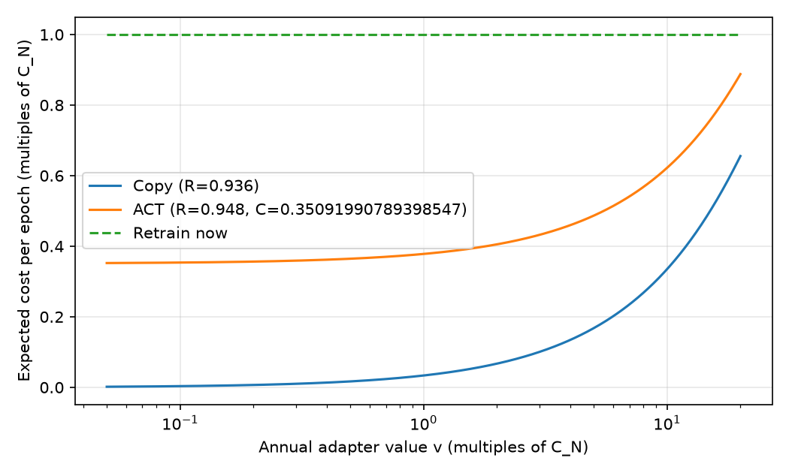

# 7.1절 모델 쌍 실험 결과 (CPU 실행)

2026-09-28, `run_pairs.py` CPU preset, 4 threads. 학습 데이터는 GSM8K이며 train 500, eval 200, calib 128을 썼습니다. LoRA rank는 8이고, 300 step, batch 4, max_len 256입니다.
원자료: `results/pairs/*.json`, `results/pairs_summary.json`, `results/real_options_pairs.json`. 표로 된 원자료: `results/pairs_results.csv`.

## 1. 회복률과 비용

held-out 응답 NLL (낮을수록 좋음). 회복률 `R = (L_none − L_method) / (L_none − L_retrain)`.

| 쌍 | NLL none | NLL retrain | NLL copy | NLL ACT | R_C (copy) | R_A (ACT) | ACT > copy | 재학습 시간 | ACT 시간 | C_A/C_N |
|---|---|---|---|---|---|---|---|---|---|---|
| Pythia-160M step133k→143k (+10k) | 2.761 | 1.351 | 1.429 | 1.434 | 0.945 | 0.941 | 아니오 | 7.5분 | 2.7분 | 0.358 |
| Pythia-160M step113k→143k (+30k) | 2.761 | 1.369 | 1.453 | 1.436 | 0.940 | 0.952 | 예 | 7.7분 | 2.7분 | 0.348 |
| Pythia-160M step73k→143k (+70k) | 2.761 | 1.344 | 2.689 | 2.053 | **0.051** | **0.500** | 예 | 7.8분 | 2.6분 | 0.334 |
| SmolLM2-360M Base→Instruct | 1.015 | 0.653 | 0.760 | 0.762 | 0.703 | 0.698 | 아니오 | 25.0분 | 15.3분 | 0.612 |
| Qwen2.5-0.5B Base→Instruct | 0.986 | 0.641 | 0.769 | 0.759 | 0.630 | 0.658 | 예 | 40.2분 | 17.4분 | 0.433 |

## 2. 경제 모형 (6.2절, 측정값 적용)

파라미터: ρ=0.1, μ=2, g=0.2, σ=0.4, C_N=1, C_A=0.358 (5쌍 C_A/C_N의 중앙값). β=4.43.

| 쌍 | v*_C | v*_A | copy 최적 | ACT 최적 | retrain 최적 | Γ |
|---|---|---|---|---|---|---|
| Pythia-160M +10k | 44.39 | 41.70 | – | 없음 (C_A ≥ Γ) | v ≥ 44.39 | 0.00 |
| Pythia-160M +30k | 40.91 | 51.09 | – | 없음 (C_A ≥ Γ) | v ≥ 40.91 | 0.14 |
| Pythia-160M +70k | 2.59 | 4.90 | v < 1.70 | 1.70 ≤ v < 2.47 | v ≥ 2.47 | 0.39 |
| SmolLM2-360M Instruct | 8.26 | 8.12 | – | 없음 (C_A ≥ Γ) | v ≥ 8.26 | 0.00 |
| Qwen2.5-0.5B Instruct | 6.64 | 7.17 | – | 없음 (C_A ≥ Γ) | v ≥ 6.64 | 0.05 |

정책별 기대 비용 그림: `results/policy_costs_pairs.png`

## 3. 요약

- **작은 업그레이드 (Pythia +10k, +30k):** adapter를 그대로 복사해도 재학습 대비 약 94%를 회복합니다. ACT의 추가 이득은 없거나 1%p 정도입니다.
- **큰 드리프트 (Pythia +70k):** 복사가 거의 실패하고(R_C=0.05), ACT는 50%를 회복합니다. 경제 모형에서 ACT가 최적 구간(1.70 ≤ v < 2.47)을 갖는 쌍은 이것뿐입니다.
- **Base → Instruct:** 복사와 ACT가 비슷합니다(0.63–0.70). Qwen에서는 ACT가 +2.7%p 앞서고, SmolLM2에서는 0.5%p 뒤집니다.
- **ACT 비용:** 재학습 대비 0.33–0.61입니다. 이 값은 계산 시간만 반영합니다. 논문대로 C_N에 데이터 확보와 재검증 비용을 더하면 C_A/C_N은 더 작아지고, ACT가 최적인 구간도 넓어집니다.

## 4. 한계

- CPU용으로 축소한 설정입니다(train 500, 300 step). 시드 1개로 돌려서 오차 막대가 없습니다.
- 회복률은 NLL로만 쟀습니다. 생성 정확도(`--gen-eval`)는 측정하지 않았습니다.
- 경제 모형의 C_A는 5쌍 중앙값 하나를 모든 쌍에 적용했습니다.
